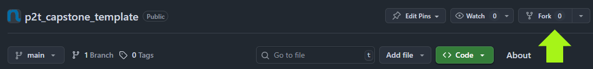

# Path2Tech Capstone Full Stack 

A modern Full Stack project utilizing React, Express, and MongoDB to create a fully functional E-Commerce application

## Prerequisites
- Node
- NPM
- MongoDB atlas account

## Checking Prerequisites
1. Check that you have Node and NPM installed, open a terminal and run

```sh
node --version
```

```sh
npm --version
```

If you get an error then you will need to go to [Download Node](https://nodejs.org/en/download) to download Node.js for your operating system.

## Installing Project
1. Please make sure to fork this repository to your personal GitHub. You will find the button to fork this repository near the top right part of the screen.



Press this button and on the next screen it will give you the option to fork the repository make sure to click the green button title "Create fork" to fork the repositoy to your own GitHub

2. Clone the repository to your machine, to do this open a new terminal and run

```sh
https://github.com/<github_repo_owner>/<github_repo_name>.git
```

To get the GitHub URL to clone the repo click on the green button title "<> Code" this will open a dropdown and you can copy the URL to clone this git repository to your system.


## Running Project
1. You will have to install your node packages from `package.json` to `node_modules`

To accomplish this, open this project in Visual Studio Code, and open a new terminal session

Run the command
```sh
npm install
```

2. To run the code you have two options, to run it with Visual Studio Code's GUI or to open a terminal and run the following command

```sh
npm start
```


## Final Notes
If you followed all the steps above correctly your environment should be set up, if there are issues you will need to go back and fix them. Please read through the documentation and re-read if any errors occur while installing project.