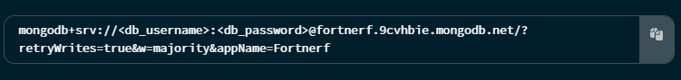
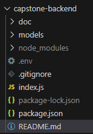

# Path2Tech Capstone Express Backend End

A robust Node.js/Express backend API for the Path2Tech Capstone e-commerce platform. Handles product management, orders, and payments.

## Features

Required Features
- **RESTful API**: JSON endpoints for frontend integration
- **Order Processing**: Checkout, order history, and status tracking
- **Database**: MongoDB with Mongoose integration

Optional Features
- **Authentication**: JWT or OAuth based user login, registration
- **Product Management**: CRUD operations for products (admin-only)
- **Payment Integration**: Stripe/Paypal webhook support
- **API Documentation**: Swagger/OpenAPI or Postman collection


## Prerequisites
- Node
- NPM
- MongoDB Atlas Account

## Checking Prerequisites
1. Check that you have Node and NPM installed, open a terminal and run

```sh
node --version
```

```sh
npm --version
```

If you get an error then you will need to go to [Download Node](https://nodejs.org/en/download) to download Node.js for your operating system.

2. You will need to have a MongoDB Atlas Account with a MongoDB Cluster set up. To accomplish this go to [MongoDB Atlas Account Creation](https://account.mongodb.com/account/register) to create an account and create a cluster. Once you create your cluster you should eventually see a connection string with your credentials to be able to connect, below is an example of what your credendtials should look like.




**You will need to replace <db_username> with the username of your CREATED user (not your actual MongoDB login credentials) and replace <db_password> with the password of your CREATED user (not your actual MongoDB login credentials)**


## Installation

**Set up environment variables**
1. Create a `.env` file in the root directory of the `capstone-backend` project below is an image of what your `capstone-backend` project should look like




2. Inside of the `.env` file create these following variables
```
DB_URL="mongodb atlas connection string" # replace with your MongoDB Connection String
```

## Project Structure
```
├── models/
└── index.js
```

## Available Scripts

To run the following scripts you can open a new terminal and then enter these commands
- `npm run start`: runs the project without hot reloading enabled, this script is supposed to run your project as a production ready server. This script starts your server at http://localhost:3500 unless you change the `PORT` environment variable
- `npm run dev`: runs the project in development mode with hot reloading enabled. This script starts your development server at http://localhost:3500
